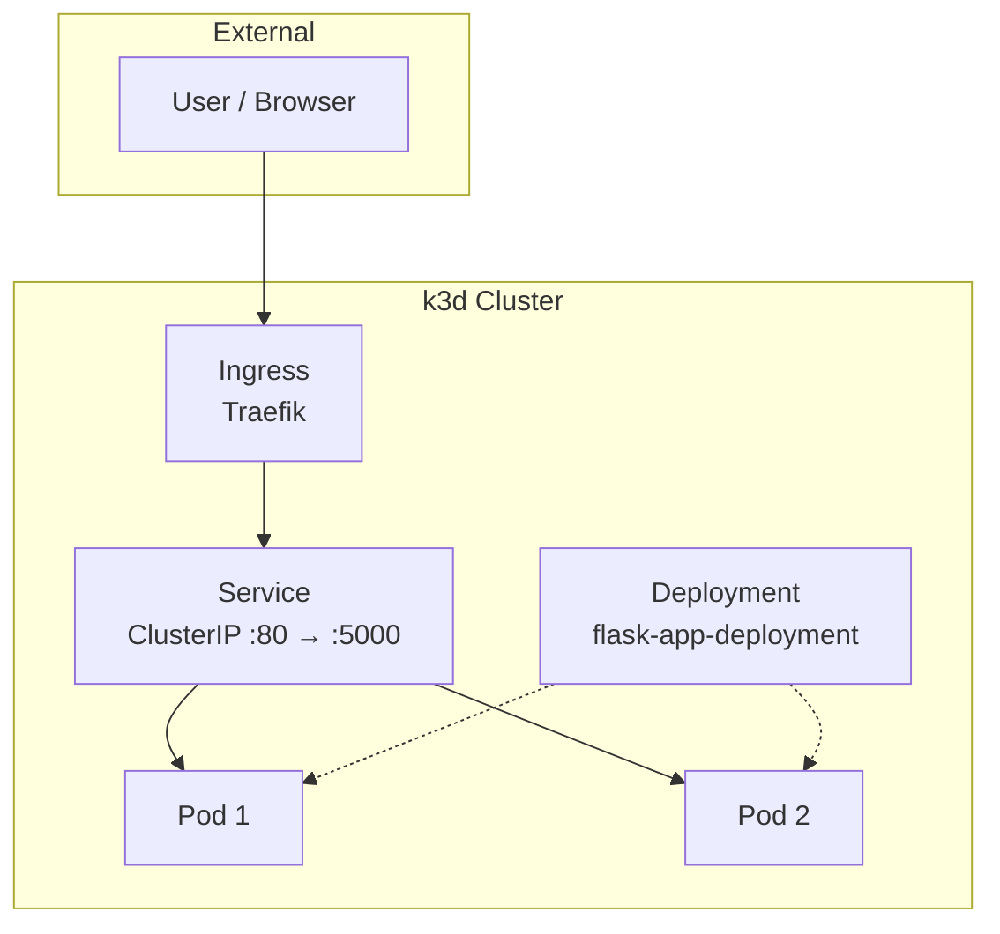

## Project 3 – Kubernetes Architecture Overview

How the Flask app from **`dockerized-app-cicd-aws-1125` (Project 2)** is deployed on Kubernetes.

---

## Architecture Diagram



---

## High-Level Components

- **User / Client**
  - Browser or `curl` calling:
    - `/` – main page.
    - `/health` – health check.
    - `/api/info` – JSON with app/env details.

- **Ingress Controller + Ingress**
  - Traefik (k3d default) terminates external HTTP and routes to the internal Service.

- **Service (`ClusterIP`)**
  - Internal load balancer for the Flask Pods; selected by `app: flask-app`.

- **Deployment + Pods**
  - Manages replicas of the Flask app; each Pod runs the Project 2 image.
  - Port `5000`; env vars from ConfigMaps/Secrets.

---

## Database Strategy

**Decision:** No database.

**Rationale:** The app is stateless (env vars + runtime info only). This project focuses on K8s deployment patterns; a DB would expand scope without adding K8s concepts.

**If a DB were needed later:** Managed service (e.g. RDS) or in-cluster DB; expose via ClusterIP Service; inject connection details via Secrets.

---

## Data Flow: Request Path

HTTP requests follow this path:

```text
User Browser / curl
        |
        v
Ingress Controller (Ingress rules)
        |
        v
Service (ClusterIP)
        |
        v
Flask Pods (Deployment)
        |
        v
Flask routes inside container
```

### Request examples

- **`GET /`** — Home page.
- **`GET /health`** — Health check; used by liveness/readiness probes.
- **`GET /api/info`** — Version, environment, hostname, runtime info.

---

## Relationship to Project 2 (Flask + Docker)

- **Reused:** Same Flask app and Docker image from Project 2; config via env vars (ConfigMaps/Secrets).
- **Kubernetes adds:** Replicas and scheduling; stable networking (Service, Ingress); health probes via `/health`.

---